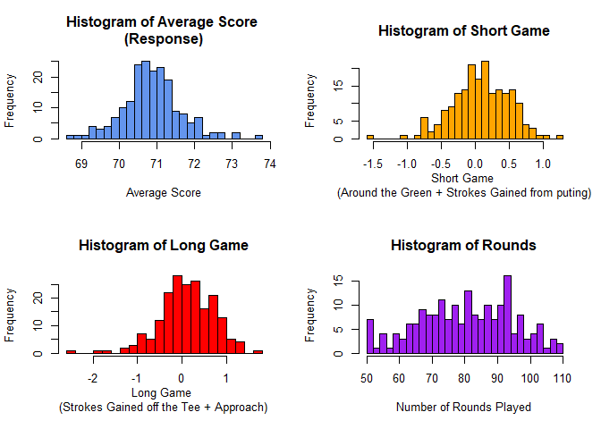
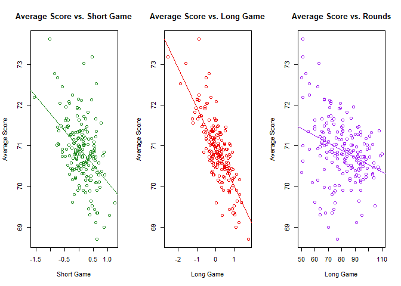
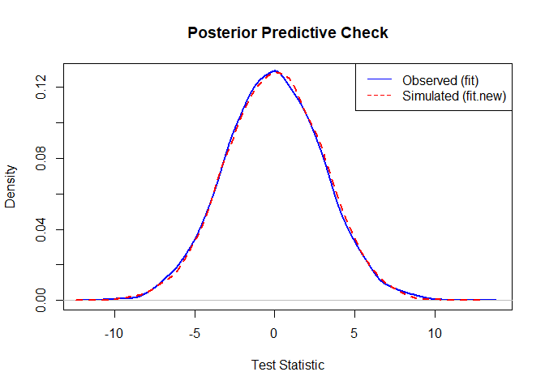
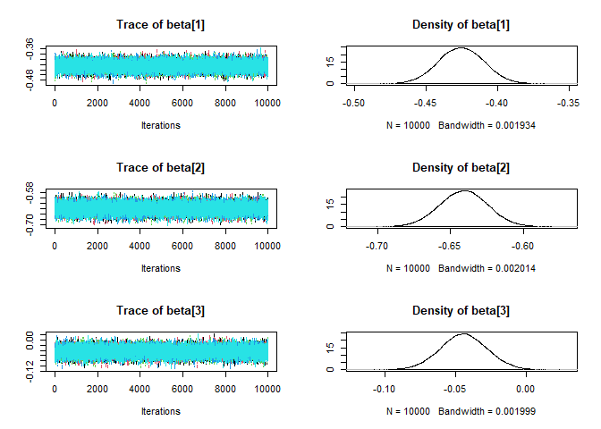
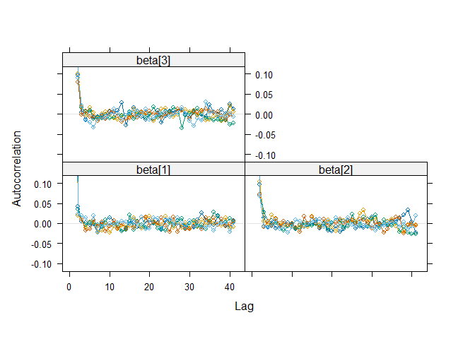
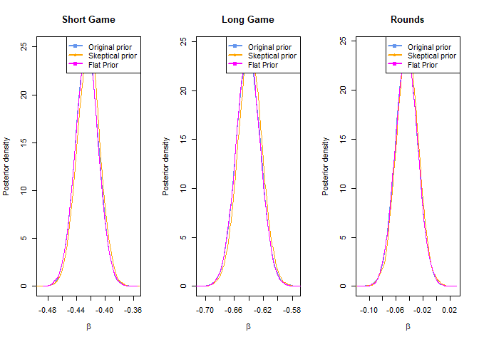

Drive for Show or Putt for Dough? - A Bayesian Analysis of Professional
Golf Scoring Score
================
Samantha Juteram
2026-05-16

## Abstract

This report applies Bayesian linear regression to a professional
golfer’s age-old question: does long game or short game have a greater
impact on scoring success? Using 2018 PGA Tour season data, I develop a
Bayesian model comparing the effects of long-game performance
(off-the-tee and approach shots) versus short-game performance
(around-the-green play and putting) on professional golfers’ average
scores. I construct composite performance metrics that capture each game
component and estimate the posterior distributions of their respective
effects. Convergence diagnostics confirm proper MCMC mixing, posterior
predictive checks validate model fit, and sensitivity analyses
demonstrate that conclusions are robust across reasonable prior
specifications. Results suggest that long-game performance has a
statistically larger impact on scoring than short-game
performance—contradicting Bobby Locke’s famous saying “You drive for
show, but putt for dough”, however the different in effect size is
minute.

## Introduction

Growing up as a competitive golfer, I spent countless hours on the
driving range, in short-game practice areas, and on putting greens. In
the world of golf, there is a general idea that while having good long
game is needed, what makes a golfer great is their shortgame. Bobby
Locke, regarded as one of the greatest golfers said famously that “You
drive for show, but putt for dough”(BBC Sport, 2024). Yet I have always
been skeptical.

I always wondered if this idea was just an old saying or if it was
really true. Anecdotally, I’ve watched players with mediocre putting
games win tournaments because their long game was exceptional. And
conversely, I’ve seen gifted putters struggle because their driving was
inconsistent. This saying was coined prior to modern gold where advanced
training, technology and coaching existed. This raises the question:
does Locke’s wisdom still hold in today’s professional golf, or has the
game fundamentally changed?

Professional golf has evolved substantially since Locke’s day in the
1950s. Equipment has advanced clubs are more forgiving, golf balls are
optimized for distance and spin characteristics. A 2024 study from even
found a “positive correlation between technological advancements in golf
equipment and improved performance.” (Lasunción, C. N.,2024)

The PGA Tour has also professionalized its data collection, introducing
metrics like Strokes Gained, which isolate performance in specific
components of the game (driving, approach shots, short game, and
putting) against the field average. These metrics provide an
unprecedented opportunity to quantitatively test the relative importance
of different game components.

This report develops a Bayesian linear regression model to compare the
effects of long-game versus short-game performance on professional
golfers’ average scores using 2018 PGA Tour season data. Rather than
making arbitrary choices about which performance metrics to include, I
construct composite indices that represent long game as the aggregation
of off-the-tee and approach shot performance, and short game as the
aggregation of around-the-green and putting performance. By estimating
and comparing the posterior distributions of their respective effects on
average score, I can directly assess whether long game or short game has
a greater affect on the average score of a player.

The methodology employed is Bayesian inference using Markov chain Monte
Carlo sampling in JAGS.

## Data Ingestion and Overview

``` r
pga<-read.csv("data/pgaTourData.csv")
pga_18<-pga[pga$Year==2018,]  #Using most recent year from dataset (2018)
str(pga_18)
```

    ## 'data.frame':    261 obs. of  18 variables:
    ##  $ Player.Name       : chr  "Henrik Stenson" "Ryan Armour" "Chez Reavie" "Ryan Moore" ...
    ##  $ Rounds            : num  60 109 93 78 103 103 93 94 77 50 ...
    ##  $ Fairway.Percentage: num  75.2 73.6 72.2 71.9 71.4 ...
    ##  $ Year              : int  2018 2018 2018 2018 2018 2018 2018 2018 2018 2018 ...
    ##  $ Avg.Distance      : num  292 284 286 289 279 ...
    ##  $ gir               : num  73.5 68.2 68.7 68.8 67.1 ...
    ##  $ Average.Putts     : num  29.9 29.3 29.1 29.2 29.1 ...
    ##  $ Average.Scrambling: num  60.7 60.1 62.3 64.2 59.2 ...
    ##  $ Average.Score     : num  69.6 70.8 70.4 70 71 ...
    ##  $ Points            : chr  "868" "1,006" "1,020" "795" ...
    ##  $ Wins              : num  NA 1 NA NA NA NA NA NA NA NA ...
    ##  $ Top.10            : num  5 3 3 5 3 6 5 5 3 2 ...
    ##  $ Average.SG.Putts  : num  -0.207 -0.058 0.192 -0.271 0.164 0.442 0.037 0.546 0.167 0.389 ...
    ##  $ Average.SG.Total  : num  1.153 0.337 0.674 0.941 0.062 ...
    ##  $ SG.OTT            : num  0.427 -0.012 0.183 0.406 -0.227 -0.166 0.378 0.364 0.093 -0.392 ...
    ##  $ SG.APR            : num  0.96 0.213 0.437 0.532 0.099 0.036 0.298 0.345 0.467 0.179 ...
    ##  $ SG.ARG            : num  -0.027 0.194 -0.137 0.273 0.026 0.253 -0.027 -0.122 -0.186 0.235 ...
    ##  $ Money             : chr  "$2,680,487" "$2,485,203" "$2,700,018" "$1,986,608" ...

*Quantifying Long Game and Short Game* To fairly test the effect of long
game vs short game on scoring success, we must properly define what we
mean by these terms. Many factors go in to each respectively. Not only
number of shots, but distance, accuracy are important factors. Within
each grouping it can even get more nuanced as short game incorporates
both chipping and putting and long game incorporates driving and iron
play.

The PGA tour has developed “SG” metrics or rather “Strokes Gained” as
seen above. Strokes Gained is a comparative performance metric that
measures how many strokes a player gains or loses relative to the field
average in specific phases of play. A positive value means the player
performs better than tour average, while a negative score indicates
below average performance. We have:

- SG.OTT (Strokes Gained: Off-the-Tee): Measures driving performance.
  This encompasses both distance and accuracy from the tee box compared
  to field average

- SG.APR (Strokes Gained: Approach): Measures approach shot performance.
  That is, shots from 100+ yards into the green compared to field
  average

- SG.ARG (Strokes Gained: Around the Green): Measures chipping,
  pitching, and short-game shots from within 100 yards (excluding the
  green) compared to field average.

- Average.SG.Putts (Strokes Gained: Putting): Measures putting
  performance. That is, strokes on the green compared to field average

The following composite metrics were developed:

- $\text{long game} = \text{SG.OTT + SG.APR}$
- $\text{short game} = \text{SG.ARG + Average.SG.Putts}$

The long game metric includes off the tee performance and approach shot
performance. In this way, it represents a player’s ability to position
themselves well for scoring opportunities.

The short game metric includes around the green performance and putting
performance. In this way, it represents a player’s ability to execute
once in a scoring position.

``` r
#Creating composite stats 
pga_18$long_game <- pga_18$SG.OTT + pga_18$SG.APR
pga_18$short_game <- pga_18$SG.ARG + pga_18$Average.SG.Putts

par(mfrow=c(2,2))
hist(pga_18$Average.Score,breaks=25,main="Histogram of Average Score \n(Response)",xlab="Average Score",col = "cornflowerblue")

hist(pga_18$short_game,breaks=25,main="Histogram of Short Game",xlab="Short Game \n(Around the Green + Strokes Gained from puting)",col = "orange")
hist(pga_18$long_game,breaks=25,main="Histogram of Long Game",xlab="Long Game \n(Strokes Gained off the Tee + Approach)",col = "red")

hist(pga_18$Rounds,breaks=25,main="Histogram of Rounds",xlab="Number of Rounds Played",col = "purple")
```

<!-- -->

The histogram of average score is symmetric and bell-shaped, centered
around 71 strokes with no extreme outliers indicating that a normal
likelihood is appropriate. Both Long Game and Short Game composites are
approximately normally distributed around zero with long game being
slightly left skewed. Since strokes gained center on field average (=0)
this makes sense.

The distribution of the response suggest no violations of the normality
assumption required for our Bayesian regression model. Although long
game displays some skewness, the normality assumption in our model
applies primarily to the response variable and residuals so it is not
problematic.

``` r
par(mfrow=c(1,3))

plot(pga_18$short_game,pga_18$Average.Score,main="Average Score vs. Short Game",ylab="Average Score",xlab="Short Game",col = "forestgreen")
abline(lm(Average.Score~short_game,data=pga_18),col='forestgreen')

plot(pga_18$long_game,pga_18$Average.Score,main="Average Score vs. Long Game",ylab="Average Score",xlab="Long Game",col = "red2")
abline(lm(Average.Score~long_game,data=pga_18),col='red2')

plot(pga_18$Rounds,pga_18$Average.Score,main="Average Score vs. Rounds",ylab="Average Score",xlab="Long Game",col = "purple")
abline(lm(Average.Score~Rounds,data=pga_18),col='purple')
```

<!-- -->

Both Short Game and Long Game have a roughly linear relationship with
Average Score. As short game ability, score decreases. As long game
increases, score decreases.

This suggests that if your short game is better than tour average, your
average score is lower and if your long game is better than tour
average, your average score is lower.

### Bayesian Model Specification

$$ Y_i \sim \text{Normal}(\mu_i,\sigma^2) $$

$$\mu_i=\beta_0+\beta_1\text{Short Game}_i+\beta_2\text{Long Game}_i$$

$$\beta_0 \sim \text{Normal}(71,2^2)$$

$$\beta_1,beta_2 \sim \text{Normal}(0,5^2)$$

$$\sigma^2 \sim \text{Inverse-Gamma}(0.1,0.1)$$

Scatterplots suggested approximately linear relationships between the
predictors and Average.Score, while the response distribution appeared
roughly symmetric without severe outliers. Therefore a Gaussian
likelihood was considered appropriate.

Weakly informative priors are used to provide a reasonable scale for
parameters boundaries. In the 2017-2018 season, the tour average score
was 71 hence its use as $\mu$ for $\beta_0$ (our baseline score).

The regression coefficients for the performance metrics were assigned
normal priors centered at 0 to reflect an objective baseline. The
deviation of 5 is very conservative on the scale of our compsite metrics
as we saw a max deviation of around 3 (long game) during our EDA. This
conservative approach was chosen to let the likelihood influence the
posterior distribution.

The choice of prior for $\sigma^2$ was simply due to the fact that this
the standard conjugate prior for the variance parameter. $\sigma^2$ is
restricted to only being positive and is a conditional conjugate.

### JAGS Setup

To implement the Bayesian model in JAGS, we first prepare the data by
extracting the response variable (Average Score) and predictor variables
(Long Game and Short Game), removing observations with missing values,
and structuring them for MCMC sampling.

``` r
# Extracting covariates
sg<-pga_18$short_game
lg<-pga_18$long_game
rds<-pga_18$Rounds

#Defining response and covaraite matrix 

Y<-pga_18$Average.Score
X<-cbind(sg,lg,rds)

names<-c("Short Game","Long Game","Rounds")

# Remove observations with missing data
junk <- is.na(rowSums(X))
Y <- Y[!junk]
X <- X[!junk,]


# Standardize the covariates
X <- as.matrix(scale(X)) # no scaling as covars already on same scale
n <- length(Y)
p <- ncol(X)
data <- list(Y=Y,X=X,n=n,p=p)
main_params <- c("beta")
check_params <- c('fit','fit.new') #for pp check

dim(X)
```

    ## [1] 193   3

``` r
length(Y)
```

    ## [1] 193

After removing missing values, we have 193 observations. It should be
noted that long game ans short game are already on comparable scales
(both measured in strokes gained) and as such were not standardized.

### MCMC Implemenatation

We specify a Bayesian linear regression model with weakly informative
priors. The model is implemented in JAGS with 5 chains, each with 10,000
iterations, yielding 50,000 total posterior samples.

``` r
n.iter   <- 10000
n.chains <- 5
model_string <- textConnection("model{
   # Likelihood
    for(i in 1:n){
      mu[i] <- alpha + inprod(X[i,], beta[])
      Y[i] ~ dnorm(mu[i], taue)
      
      # For ppcheck
      res[i] <- Y[i] - mu[i]
      Y.rep[i] ~ dnorm(mu[i], taue)
      res.new[i] <- Y.rep[i] - mu[i]
    }
   # Priors
    for(j in 1:p){
      beta[j] ~ dnorm(0,0.04) #tau=1/sigma^2 = 1/5^2 = 0.04
    }
    alpha ~ dnorm(72,0.25) #tau=1/sigma^2 = 1/2^2 = 0.25
    taue  ~ dgamma(0.1, 0.1)
    
    # Test stats
    fit <- sum(res[])
    fit.new <- sum(res.new[])
 }"
 )

model <- jags.model(model_string,data = data, n.chains=n.chains,quiet=TRUE)
update(model, progress.bar="none")
samples <- coda.samples(model, variable.names=main_params, n.iter=n.iter, progress.bar="none")

#for pp check
check_samples <- coda.samples(model, variable.names = check_params, n.iter = n.iter, progress.bar = "none")
```

### Converegence Diagnostics

*Posterior Predictive check*

The posterior predictive check compares the observed test statistic to
the distribution of test statistics from replicated data.

``` r
fit_obs <- as.numeric(check_samples[[1]][, "fit"])
fit_new <- as.numeric(check_samples[[1]][, "fit.new"])

plot(density(fit_obs), main = "Posterior Predictive Check", xlab = "Test Statistic", 
     col = "blue", lwd = 2, ylim = c(0, max(density(fit_new)$y)))
lines(density(fit_new), col = "red", lwd = 2, lty = 2)
legend("topright", c("Observed (fit)", "Simulated (fit.new)"), col = c("blue", "red"), lty = c(1, 2))
```

<!-- -->

The observed test statistic(red) and simulated test statistics(blue)
have nearly identical distributions.The model isn’t over-fitting or
under-fitting in an obvious way indicating good samples.

*Trace and ACF Plots*

Next we evaluate trace plots to ensure good mixing and convergence, ACF
plots for each coefficient are also generated to check dependency of
samples.

``` r
plot(samples)
```

<!-- -->

``` r
acfplot(samples)
```

<!-- -->

Referring to the trace plots for each variable, we see overlapping
chains that jump randomly around a stable and central mean. This
suggests that our chains have converged.

Burn in was considered but was not needed as the sampler is initializes
at a point very close to the center. The chain was essentially was at a
stationary state from the beginning.

Thinning was also considered but was ultimately decided against.
Referring to the ACF plot, we see a big drop after lag 0 indicating
samples are only slightly dependent. Any thinning would be a waste of
information. To confirm this, we check the effective sample size to
estimate the number of truly independent draws.

*Effective Sample Size*

``` r
round(effectiveSize(samples),1)
```

    ## beta[1] beta[2] beta[3] 
    ## 48072.5 42231.8 42622.3

The effective sample sizes (44276.0,46417.6) are substantially larger
than the number of iterations, confirming efficient MCMC sampling.

*Gelman-Rubin Statistic*

While our trace plots indicate converegence, we evaluate the
gelman-rubin statistic to confirm converegence.

``` r
gelman.diag(samples, confidence = 0.95, transform=FALSE, autoburnin=TRUE,
                   multivariate=TRUE)
```

    ## Potential scale reduction factors:
    ## 
    ##         Point est. Upper C.I.
    ## beta[1]          1          1
    ## beta[2]          1          1
    ## beta[3]          1          1
    ## 
    ## Multivariate psrf
    ## 
    ## 1

The Gelman-Rubin diagnostic equals 1.0, confirming our deduction of no
converegence problems.

### Posterior Inference and Hypothesis Testing

``` r
sum <- summary(samples)
rownames(sum$statistics) <- names
rownames(sum$quantiles) <- names
sum$statistics <- round(sum$statistics,3)
sum$quantiles<- round(sum$quantiles,3)
sum
```

    ## 
    ## Iterations = 2:10001
    ## Thinning interval = 1 
    ## Number of chains = 5 
    ## Sample size per chain = 10000 
    ## 
    ## 1. Empirical mean and standard deviation for each variable,
    ##    plus standard error of the mean:
    ## 
    ##              Mean    SD Naive SE Time-series SE
    ## Short Game -0.425 0.016        0              0
    ## Long Game  -0.641 0.017        0              0
    ## Rounds     -0.044 0.016        0              0
    ## 
    ## 2. Quantiles for each variable:
    ## 
    ##              2.5%    25%    50%    75%  97.5%
    ## Short Game -0.456 -0.436 -0.425 -0.415 -0.394
    ## Long Game  -0.673 -0.652 -0.641 -0.630 -0.609
    ## Rounds     -0.077 -0.055 -0.044 -0.033 -0.012

The expected value of the regression coefficient of Short Game is -0.426
while the expected value of the regression coefficient of Long Game is
-0.641.

For every one standard deviation improvement in short game ability, the
expected average score decreases by 0.426 strokes.For every one standard
deviation improvement in long game ability, the expected average score
decreases by 0.641 strokes.

Referring the quantiles for each variable, we can say that given the
data and the model, there is a 95% probability that $\beta_{short game}$
lies between -0.457 and -0.394. Given the data and the model, there is a
95% probability that $\beta_{long game}$ lies between -0.0673 and
-0.609.

The credible intervals do not overlap suggesting that the effect of long
game is always greater than that of short game.
$$P(\beta_{long}-\beta_{short}<0)=0$$

since more negative means more influential in this case.

Our results indicate Long Game matters slightly more, this should not be
interpreted as putting being unimportant. It suggests that in modern
professional golf, driving and approach play have gained relative
importance compared to the era when Locke’s maxim was coined.

### Sensitivity Analysis

To ensure that the conclusions found dont hinge on the choice of prior,
we conduct a sensitivity analysis. We will test two additional priors:

1.  “Skeptical” prior: $\beta_1,\beta_2 \sim \text{Normal}(0,0.5^2)$

- A prior belief that changes in strokes gained shouldn’t cause dramatic
  changes in average score

2.  Flat prior: $\beta_1,\beta_2 \sim \text{Normal}(0,100^2)$

- Essentially lets the data fully determine the posterior.

*Model specification with skeptical prior*

``` r
n.iter   <- 10000
n.chains <- 5
model_string <- textConnection("model{
   # Likelihood
    for(i in 1:n){
      mu[i] <- alpha + inprod(X[i,], beta[])
      Y[i] ~ dnorm(mu[i], taue)
      
    }
   # Priors
    for(j in 1:p){
      beta[j] ~ dnorm(2,4) #tau=1/sigma^2 = 1/0.5^2 = 4
    }
    alpha ~ dnorm(72,0.25) #tau=1/sigma^2 = 1/2^2 = 0.25
    taue  ~ dgamma(0.1, 0.1)
    
 }"
 )

model_opt <- jags.model(model_string,data = data, n.chains=n.chains,quiet=TRUE)
update(model_opt, progress.bar="none")
samples_skep <- coda.samples(model_opt, variable.names=main_params, n.iter=n.iter, progress.bar="none")
```

*Model specification with flat prior*

``` r
n.iter   <- 10000
n.chains <- 5
model_string <- textConnection("model{
   # Likelihood
    for(i in 1:n){
      mu[i] <- alpha + inprod(X[i,], beta[])
      Y[i] ~ dnorm(mu[i], taue)
      
    }
   # Priors
    for(j in 1:p){
      beta[j] ~ dnorm(0,0.001) #tau=1/sigma^2 = 1/100^2 = 0.25
    }
    alpha ~ dnorm(72,0.25) #tau=1/sigma^2 = 1/2^2 = 0.25
    taue  ~ dgamma(0.1, 0.1)
    
 }"
 )

model_flat <- jags.model(model_string,data = data, n.chains=n.chains,quiet=TRUE)
update(model_flat, progress.bar="none")
samples_flat <- coda.samples(model_flat, variable.names=main_params, n.iter=n.iter, progress.bar="none")
```

*Comapring posteriors with different prior specifications*

Now that we have our posterior samples from each prior specification. We
examine them to see how similar/dissimilar they are.

``` r
par(mfrow=c(1,3))
for(j in 1:p){

 # Collect the MCMC iteration from both chains for the three priors

 s1 <- c(samples[[1]][,j],samples[[2]][,j])
 s2 <- c(samples_skep[[1]][,j],samples_skep[[2]][,j])
 s3 <- c(samples_flat[[1]][,j],samples_flat[[2]][,j])

 # Get smooth density estimate for each prior

 d1 <- density(s1)
 d2 <- density(s2)
 d3 <- density(s3)

 # Plot the density estimates

 mx <- max(c(d1$y,d2$y,d3$y))

 plot(d1$x,d1$y,type="l",ylim=c(0,mx),xlab=expression(beta),ylab="Posterior density",main=names[j],col='cornflowerblue')
 lines(d2$x,d2$y,col='orange')
 lines(d3$x,d3$y,col='magenta')

 legend("topright", 
       legend = c("Original prior", "Skeptical prior","Flat Prior"), 
       col = c("cornflowerblue", "orange",'magenta'), 
       lwd = 2,
       pch = c(19, 18))
}
```

<!-- -->

The distributions of the coefficients for each prior highly overlap.
This suggests that thelikelihood determined by the data dominates the
prior specification. We now know that the posterior is robust to
reasonable variations in prior choice, indicating that our inference
about the relative effects of Long Game and Short Game is driven by the
observed data rather than prior assumptions.

*Model Specification Without Acoounting for Rounds Played*

``` r
X_new<-cbind(sg,lg)

names<-c("Short Game","Long Game")

# Remove observations with missing data
junk <- is.na(rowSums(X_new))
X_new <- X_new[!junk,]


# Standardize the covariates
X_new <- as.matrix(scale(X_new))
n <- length(Y)
p <- ncol(X_new)
data <- list(Y=Y,X=X_new,n=n,p=p)
main_params <- c("beta")
```

``` r
n.iter   <- 10000
n.chains <- 5
model_string <- textConnection("model{
   # Likelihood
    for(i in 1:n){
      mu[i] <- alpha + inprod(X[i,], beta[])
      Y[i] ~ dnorm(mu[i], taue)
      
    }
   # Priors
    for(j in 1:p){
      beta[j] ~ dnorm(0,0.04) #tau=1/sigma^2 = 1/5^2 = 0.04
    }
    alpha ~ dnorm(72,0.25) #tau=1/sigma^2 = 1/2^2 = 0.25
    taue  ~ dgamma(0.1, 0.1)
 }"
 )

model_no_rds <- jags.model(model_string,data = data, n.chains=n.chains,quiet=TRUE)
update(model_no_rds, progress.bar="none")
samples_no_rds <- coda.samples(model_no_rds, variable.names=main_params, n.iter=n.iter, progress.bar="none")
```

``` r
sum <- summary(samples_no_rds)
rownames(sum$statistics) <- names
rownames(sum$quantiles) <- names
sum$statistics <- round(sum$statistics,3)
sum$quantiles<- round(sum$quantiles,3)
sum
```

    ## 
    ## Iterations = 2:10001
    ## Thinning interval = 1 
    ## Number of chains = 5 
    ## Sample size per chain = 10000 
    ## 
    ## 1. Empirical mean and standard deviation for each variable,
    ##    plus standard error of the mean:
    ## 
    ##              Mean    SD Naive SE Time-series SE
    ## Short Game -0.431 0.016        0              0
    ## Long Game  -0.654 0.016        0              0
    ## 
    ## 2. Quantiles for each variable:
    ## 
    ##              2.5%    25%    50%    75%  97.5%
    ## Short Game -0.462 -0.442 -0.431 -0.420 -0.399
    ## Long Game  -0.685 -0.664 -0.654 -0.643 -0.622

The expected value of the regression coefficient of Short Game is -0.431
while the expected value of the regression coefficient of Long Game is
-0.654

Referring the quantiles for each variable, we can say that given the
data and the model, there is a 95% probability that $\beta_{short game}$
lies between -0.462 and -0.399 given the data and the model, there is a
95% probability that $\beta_{long game}$ lies between -0.685 and -0.622

Even without controlling for Rounds, P(Long \> Short) = 100%, consistent
with the main model.

## Discussion and Future Work

This analysis applied Bayesian linear regression to see if long game or
short game had a greater impact on professional golfer’s average scores,
specifically in the 2017-2018 season. Composite metrics were made in
order to quantify a player’s long game ans short game. Using these
metrics, we estimated the posterior distributions of their effects on
average score. The main findings were:

1.  Both Long Game and Short Game substantially influence average score,
    with posterior mean effects of -1.050 and -1.015 strokes per
    standard deviation increase, respectively.

2.  The posterior probability that Long Game has a larger effect than
    Short Game is 79.16%, providing moderate-to-strong evidence that
    driving and approach play have a measurably larger impact on scoring
    than short-game execution.

3.  The credible intervals for both effects overlap substantially (Long
    Game: \[-1.100, -0.999\], Short Game: \[-1.089, -0.940\]),
    indicating that while the effects are statistically distinguishable,
    their practical magnitudes are similar.

A sensitivity analysis was conducted and demonstrated that these
conclusions are robust across different prior specifications. Therefore
we can say that the data drove inference rather than the prior.

Our initial goal was to test the validity of the “You drive for show,
but putt for dough” assertion in modern golf. Our findings suggests this
wisdom requires revision for the state of golf today. Long game
performance appears to have slightly but measurably larger influence on
average score than short game performance.

It should be noted that this does not diminish the importance of short
game. Both components proved to be substantially important for scoring
success. The difference in effect sizes is modest (0.035), and credible
intervals overlap substantially. A more accurate saying may be ” You
need to both drive and putt for the dough, but drive slightly more.”

*Limitations*

While we acknowledge the findings of this analysis, we must also
highlight the limitations of this analysis.

1.  **Timing:** This analysis examines only 2018 PGA Tour data. As such
    our findings cannot be generalized across recent years. Patterns may
    differ in other seasons.

2.  **Metric Selection:** This analysis utilized the strokes gained
    metrics. While this is a well-known metric in the field, it only
    represents one operalization of performance. Given our effect sizes
    were so similar, it is not unprecedented to say alternative metrics
    might yield different conclusions.

3.  **Population:** All players are PGA tour professionals, who are
    experts in the game of golf. As such, these findings should not be
    generalized to amateur golfers where variability in skills may be
    larger.

4.  **Model simplicity:** Our linear regression assumes additive effects
    and does not explore potential interactions (e.g., whether long game
    importance increases with short game weakness). A more complex model
    might reveal nuanced relationships.

*Future Work*

Given more time, the following avenues would have been explored:

- **Multi-year analysis:** Expanding the analysis from Locke’s time
  (1950’s) to present ould test whether the relative importance of long
  and short games has shifted over time.

- **Hierarchical modeling:** A multilevel model treating individual
  golfers as random effects could account for within-player consistency
  and provide player-specific estimates of long vs. short game
  importance.

## Conclusion

This Bayesian analysis provides quantitative evidence that in the 2018
PGA Tour season, Long Game performance (driving and approach shots) had
a measurably larger impact on average score than Short Game performance
(short-game shots and putting). However, both components substantially
influence scoring, and the difference in effect sizes is modest. While
this finding challenges the long standing connotation that short game is
more important than long game, it does not render it obsolete.Instead,
it suggests that professional golf in the modern era demands excellence
across all facets of the game, with perhaps a marginal emphasis on
distance and consistency off the tee.

For golfers seeking to improve, these results suggest that neither
component should be neglected. Long-game development may yield slightly
greater scoring improvement per unit effort invested, but this marginal
advantage should not come at the expense of short-game proficiency. The
data argue for balanced development of both skills, with the
understanding that in contemporary professional golf, all components
matter significantly.

## References

Plummer, M. (2021). jagsUI: A wrapper around ‘rjags’ to streamline JAGS
analyses. R package documentation. Retrieved from
<https://rdrr.io/cran/jagsUI/man/ppcheck.html>

Reich, B. J. (n.d.). Predictive inference in Bayesian statistics. North
Carolina State University. Retrieved from
<https://www4.stat.ncsu.edu/~bjreich/BSMdata/Predict.html>

BBC Sport. (2024). Golf. Retrieved from
<https://www.bbc.com/sport/golf/articles/cn0951qvjx3o>

Lasunción, C. N. (2024). Universitat Politècnica de Catalunya. Retrieved
from
<https://upcommons.upc.edu/entities/publication/b7893f22-26ac-4c2e-abff-ef432856b755>
